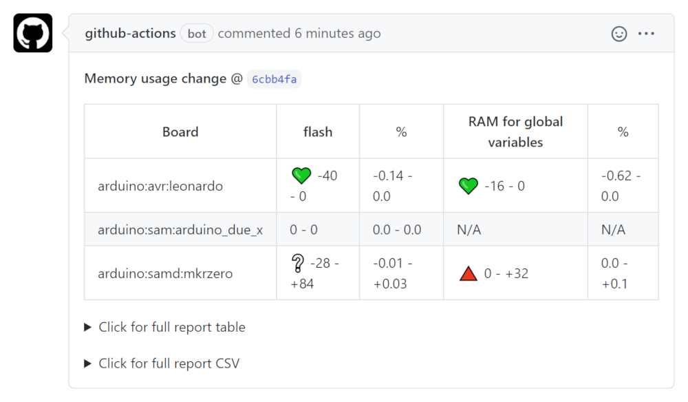

# `arduino/report-size-deltas` action

[](https://github.com/arduino/report-size-deltas/actions/workflows/check-npm-task.yml)
[](https://github.com/arduino/report-size-deltas/actions?workflow=libraries/report-size-deltas+workflow)
[](https://github.com/arduino/report-size-deltas/actions/workflows/test-integration.yml)
[](https://github.com/arduino/report-size-deltas/actions?workflow=Spell+Check)
[](https://github.com/arduino/report-size-deltas/actions/workflows/sync-labels-npm.yml)
[](https://codecov.io/gh/arduino/report-size-deltas)

This action comments on the pull request with a report on the resulting change in memory usage of the [Arduino](https://www.arduino.cc/) sketches compiled by the [`arduino/compile-sketches`](https://github.com/arduino/compile-sketches) action. This should be run from a [scheduled workflow](https://help.github.com/en/actions/reference/workflow-syntax-for-github-actions#onschedule).



## Table of contents

<!-- toc -->

- [Inputs](#inputs)
  - [`sketches-reports-source`](#sketches-reports-source)
    - [Run from a scheduled workflow](#run-from-a-scheduled-workflow)
    - [Run from the same workflow as the `arduino/compile-sketches` action](#run-from-the-same-workflow-as-the-arduinocompile-sketches-action)
  - [`github-token`](#github-token)
- [Example usage](#example-usage)
  - [Scheduled workflow](#scheduled-workflow)
  - [Workflow triggered by `pull_request` event](#workflow-triggered-by-pull_request-event)

<!-- tocstop -->

## Inputs

### `sketches-reports-source`

**Default**: "sketches-reports"

The action can be used in two ways:

#### Run from a [scheduled workflow](https://help.github.com/en/actions/reference/workflow-syntax-for-github-actions#onschedule)

Recommended for public repositories.

The use of a scheduled workflow is necessary in order for the action to have the [write permissions required to comment on pull requests submitted from forks](https://help.github.com/en/actions/configuring-and-managing-workflows/authenticating-with-the-github_token).

In this usage, the `sketches-reports-source` defines the name of the workflow artifact that contains the memory usage data, as specified to the [`actions/upload-artifact`](https://github.com/actions/upload-artifact) action via its `name` input.

#### Run from the same workflow as the [`arduino/compile-sketches`](https://github.com/arduino/compile-sketches) action

Recommended for private repositories.

If configured to trigger on a short interval, the scheduled workflow method can use a lot of GitHub Actions minutes, quickly using up the limited allotment provided by GitHub for private repositories (public repositories get unlimited free minutes). For this reason, it may be preferable to only run the action as needed.

In order to get reports for pull requests from forks, the ["Send write tokens to workflows from fork pull requests" setting](https://docs.github.com/en/github/administering-a-repository/disabling-or-limiting-github-actions-for-a-repository#enabling-workflows-for-private-repository-forks) must be enabled.

If the "Send write tokens to workflows from fork pull requests" setting is not enabled but the ["Run workflows from fork pull requests" setting](https://docs.github.com/en/github/administering-a-repository/disabling-or-limiting-github-actions-for-a-repository#enabling-workflows-for-private-repository-forks) is enabled, the workflow should be configured to only run the action when the pull request is not from a fork (`if: github.event.pull_request.head.repo.full_name == github.repository`). This will prevent workflow job failures that would otherwise be caused when the report creation failed due to not having the necessary write permissions.

In this usage, the `sketches-reports-source` defines the path to the folder containing the memory usage data, as specified to the [`actions/download-artifact`](https://github.com/actions/download-artifact) action via its `path` input.

### `github-token`

[GitHub access token](https://docs.github.com/en/github/authenticating-to-github/creating-a-personal-access-token) used to comment the memory usage comparison results to the PR thread.

**Default**: [`GITHUB_TOKEN`](https://help.github.com/en/actions/configuring-and-managing-workflows/authenticating-with-the-github_token)

## Example usage

### Scheduled workflow

```yaml
on:
  schedule:
    - cron:  '*/5 * * * *'
jobs:
  build:
    runs-on: ubuntu-latest
    steps:
      - uses: arduino/report-size-deltas@v1
```

This must be used in conjunction with a workflow that runs the [`arduino/compile-sketches`](https://github.com/arduino/compile-sketches) action and uploads the resulting sketches report to a [workflow artifact](https://help.github.com/en/actions/configuring-and-managing-workflows/persisting-workflow-data-using-artifacts):
```yaml
on: [push, pull_request]
jobs:
  compile:
    runs-on: ubuntu-latest
    steps:
      - uses: actions/checkout@v2
      - uses: arduino/compile-sketches@v1
        with:
          enable-deltas-report: true
      - uses: actions/upload-artifact@v2
        with:
          name: sketches-reports
          path: sketches-reports
```

### Workflow triggered by `pull_request` event

```yaml
on: [push, pull_request]
env:
  # It's convenient to set variables for values used multiple times in the workflow
  SKETCHES_REPORTS_PATH: sketches-reports
  SKETCHES_REPORTS_ARTIFACT_NAME: sketches-reports
jobs:
  compile:
    runs-on: ubuntu-latest
    strategy:
      matrix:
        fqbn:
          - "arduino:avr:uno"
          - "arduino:samd:mkrzero"
    steps:
      - uses: actions/checkout@v2

      - uses: arduino/compile-sketches@v1
        with:
          fqbn: ${{ matrix.fqbn }}
          enable-deltas-report: true
          sketches-report-path: ${{ env.SKETCHES_REPORTS_PATH }}

      # This step is needed to pass the size data to the report job 
      - name: Upload sketches report to workflow artifact
        uses: actions/upload-artifact@v2
        with:
          name: ${{ env.SKETCHES_REPORTS_ARTIFACT_NAME }}
          path: ${{ env.SKETCHES_REPORTS_PATH }}

  # When using a matrix to compile for multiple boards, it's necessary to use a separate job for the deltas report
  report:
    needs: compile  # Wait for the compile job to finish to get the data for the report
    if: github.event_name == 'pull_request' # Only run the job when the workflow is triggered by a pull request
    runs-on: ubuntu-latest
    steps:
      # This step is needed to get the size data produced by the compile jobs
      - name: Download sketches reports artifact
        uses: actions/download-artifact@v2
        with:
          name: ${{ env.SKETCHES_REPORTS_ARTIFACT_NAME }}
          path: ${{ env.SKETCHES_REPORTS_PATH }}

      - uses: arduino/report-size-deltas@v1
        with:
          sketches-reports-source: ${{ env.SKETCHES_REPORTS_PATH }}
```
