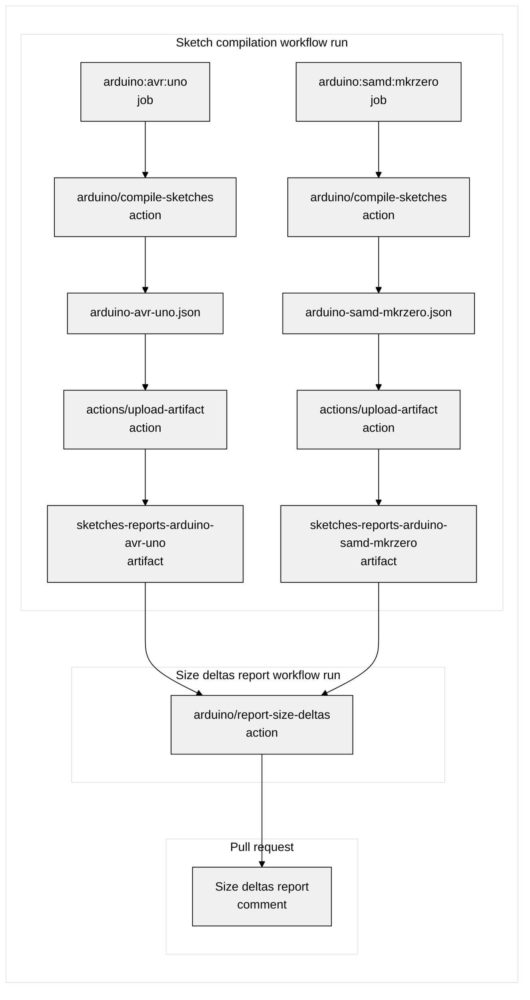

# Frequently Asked Questions

## How can I work with sketches reports for multiple boards?

It is common for Arduino projects to target multiple boards. In this case, the sketch compilation job in the workflow should be configured to compile for each of the target boards in order to provide comprehensive coverage.

This can be accomplished in an easily maintainable and efficient manner by using a [matrix](https://docs.github.com/actions/using-workflows/workflow-syntax-for-github-actions#jobsjob_idstrategymatrix) to generate a parallel workflow job for each board.

Each sketch compilation job will generate a [sketches report file](https://github.com/arduino/compile-sketches#sketches-report-path) containing the data the **arduino/report-size-deltas** action will use to produce the size deltas report comment. The sketches report file is passed from the sketch compilation job to the job containing the **arduino/report-size-deltas** step via a [workflow artifact](https://docs.github.com/actions/using-workflows/storing-workflow-data-as-artifacts).

### Size deltas report workflow triggered by `schedule` event

#### Sketch compilation workflow

```yaml
on:
  - push
  - pull_request

jobs:
  compile:
    runs-on: ubuntu-latest

    env:
      # It's convenient to set variables for values used multiple times in the workflow.
      SKETCHES_REPORTS_PATH: sketches-reports

    strategy:
      matrix:
        board:
          # Each element in the sequence produces a matrix job:
          - fqbn: arduino:avr:uno
            # This suffix will be used to define a unique name for the sketches report artifact.
            artifact-name-suffix: arduino-avr-uno
          - fqbn: arduino:samd:mkrzero
            artifact-name-suffix: arduino-samd-mkrzero

    steps:
      - uses: actions/checkout@v4

      - uses: arduino/compile-sketches@v1
        with:
          enable-deltas-report: true
          fqbn: ${{ matrix.board.fqbn }}
          sketches-report-path: ${{ env.SKETCHES_REPORTS_PATH }}

      - uses: actions/upload-artifact@v4
        with:
          # A fixed prefix on the artifact name allows the arduino/report-size-deltas action to identify the sketches
          # report artifacts.
          name: sketches-report-${{ matrix.board.artifact-name-suffix }}
          path: ${{ env.SKETCHES_REPORTS_PATH }}
```

#### Size deltas report workflow

```yaml
on:
  schedule:
    - cron: "*/5 * * * *"

jobs:
  build:
    runs-on: ubuntu-latest

    steps:
      - uses: arduino/report-size-deltas@v1
        with:
          # This regular expression matches names of sketches report artifacts produced by sketch compilation workflow.
          sketches-reports-source: ^sketches-report-.+
```

#### Overview of sketches report data flow



### Workflow triggered by `pull_request` event

```yaml
on:
  - push
  - pull_request

env:
  # It's convenient to set variables for values used multiple times in the workflow.
  SKETCHES_REPORTS_PATH: sketches-reports

jobs:
  compile:
    runs-on: ubuntu-latest

    strategy:
      matrix:
        board:
          # Each element in the sequence produces a matrix job:
          - fqbn: arduino:avr:uno
            # This suffix will be used to define a unique name for the sketches report artifact.
            artifact-name-suffix: arduino-avr-uno
          - fqbn: arduino:samd:mkrzero
            artifact-name-suffix: arduino-samd-mkrzero

    steps:
      - uses: actions/checkout@v4

      - uses: arduino/compile-sketches@v1
        with:
          fqbn: ${{ matrix.board.fqbn }}
          enable-deltas-report: true
          sketches-report-path: ${{ env.SKETCHES_REPORTS_PATH }}

      # This step is needed to pass the size data to the report job.
      - name: Upload sketches report to workflow artifact
        uses: actions/upload-artifact@v4
        with:
          name: sketches-reports-${{ matrix.board.artifact-name-suffix }}
          path: ${{ env.SKETCHES_REPORTS_PATH }}

  # When using a matrix to compile for multiple boards, it's necessary to use a separate job for the deltas report
  report:
    needs: compile # Wait for the compile job to finish to get the data for the report
    if: github.event_name == 'pull_request' # Only run the job when the workflow is triggered by a pull request
    runs-on: ubuntu-latest

    steps:
      # This step is needed to get the size data produced by the compile jobs
      - name: Download sketches reports artifacts
        uses: actions/download-artifact@v4
        with:
          # All workflow artifacts will be downloaded to this location.
          path: ${{ env.SKETCHES_REPORTS_PATH }}

      - uses: arduino/report-size-deltas@v1
        with:
          sketches-reports-source: ${{ env.SKETCHES_REPORTS_PATH }}
```
